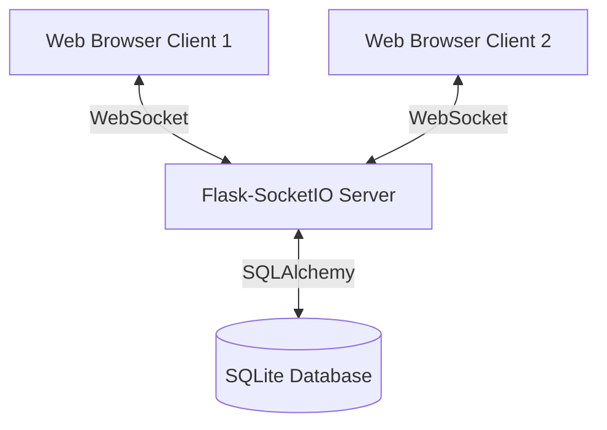

# Python Web Chat Application

Live: https://chatsite-09c5.onrender.com/

## Introduction

A real-time, browser-based chat application built with Python and Flask. This project replaces a legacy TCP-socket Tkinter application with a modern web architecture while maintaining the original database and concurrency models.

- **Backend**: Flask with Flask-SocketIO for managing real-time WebSocket connections.
- **Frontend**: Lightweight HTML, CSS, and vanilla JavaScript.
- **Data & Security**: User credentials stored in SQLite, accessed via SQLAlchemy Core. Passwords are securely hashed with a per-user salt.

## Architecture Overview



### Server Design

1. **Connection Handling**
   The server relies on Flask-SocketIO and the Eventlet worker class to manage asynchronous WebSocket connections, allowing for high concurrency with low message delay.

2. **Concurrency Control**
   To ensure data consistency in the threaded environment, shared in-memory session data (online users, room states) is managed through a `ChatData` structure protected by a reentrant mutex lock.

3. **Database**
   User credentials (username, hashed password, and salt) are stored in a SQLite database (`chatapp.db`).

### Client Design

The frontend is a single-page application (SPA) implemented in `templates/index.html`. 
It utilizes the Socket.IO browser library to establish a persistent connection with the server. DOM updates are handled via vanilla JavaScript in response to server events, ensuring instant visual updates without page reloads.

## Setup and Installation

### Local Development

1. **Install Dependencies**
   It is recommended to use a virtual environment.
   ```bash
   pip install -r requirements.txt
   ```

2. **Run the Application**
   ```bash
   python app.py
   ```

3. **Access the Chat**
   Open a web browser and navigate to:
   ```
   http://127.0.0.1:65432
   ```

### Production Deployment

The project is structured for immediate deployment to PaaS providers (e.g., Render, Heroku) that support WebSockets.

- The `Procfile` specifies `gunicorn --worker-class eventlet -w 1 app:app` as the entry point.
- The application automatically binds to the `PORT` environment variable.

## Usage Guide

1. **Authentication**: Register a new account or log in with an existing one.
2. **Lobby**: Upon logging in, users enter the global lobby. The lobby displays a real-time list of available chat rooms and online users.
3. **Rooms**: Users can create new rooms or join existing ones.
4. **Messaging**: 
   - Standard messages are broadcast to everyone in the current room.
   - Private messages can be sent using the syntax: `\private <username> <message>`

## WebSocket Event Protocol

The application communicates exclusively via Socket.IO events.

### Client-to-Server Events

- `register`: Expects `{username, password}`.
- `login`: Expects `{username, password}`.
- `create_room`: Expects `{room}`.
- `enter_room`: Expects `{room, current_room}`.
- `leave_room`: Expects `{room}`.
- `msg`: Expects `{to, text, room}`. Set `to` to "public" for room-wide broadcasts or a specific username for private messages.
- `logout`: Terminates the session.

### Server-to-Client Acknowledgements

- `register_ack`: Returns `{status, message}`.
- `login_ack`: Returns `{status, message, data: {username, chatroom}}`.
- `list_lobby_ack`: Pushes updated global room states to all users in the lobby.
- `list_room_ack`: Pushes updated user lists to all clients in a specific room.
- `msg`: Pushes new messages to clients. Returns `{from, to, text}`.
